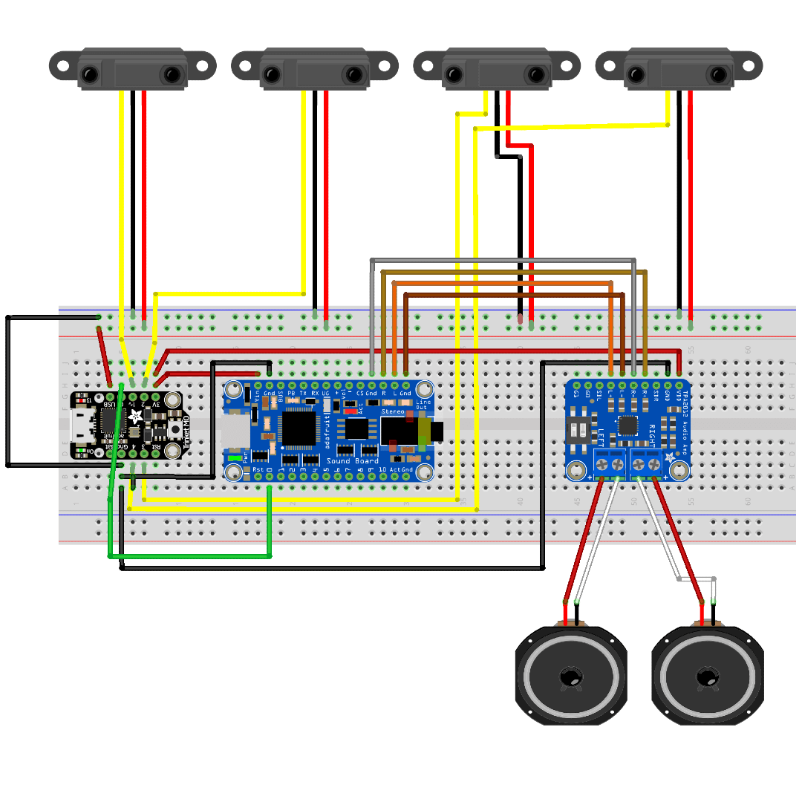

# CircuitPython Multi-Trigger

This is a revision of the code used for [Screaming Cauldrons](https://github.com/eat-sleep-code/circuitpython-halloween-cauldrons) and [A Very Merry CircuitPython Christmas](https://github.com/eat-sleep-code/circuitpython-christmas) projects.

This version will allow you to use a single Trinket M0 to handle the inputs from 4 Sharp Proximity sensors.   

The limitation is that you will now only be able to trigger a single pin on the Audio FX board.  

This is purely because there are only 5 available pins on the Trinket M0.   Other CircuitPython boards may offer more pins but have not been tested with this script.

